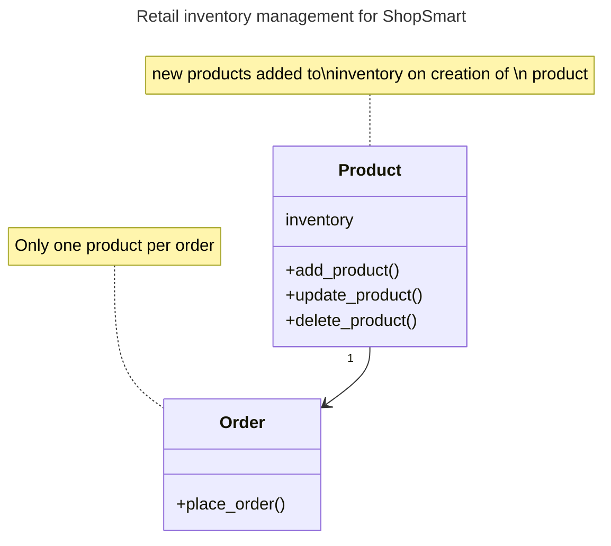

# Retail inventory for ShopSmart

## System diagrams

```mermaid
---
title: Retail inventory management for ShopSmart
---
classDiagram
    class Product{
        inventory
        
        +add_product()
        +update_product()
        +delete_product()
    }
    class Order{
        +place_order()
    }
    note for Product "new products added to\ninventory on creation of \n product"
    Product "1"--> Order
    note for Order "Only one product per order"
```